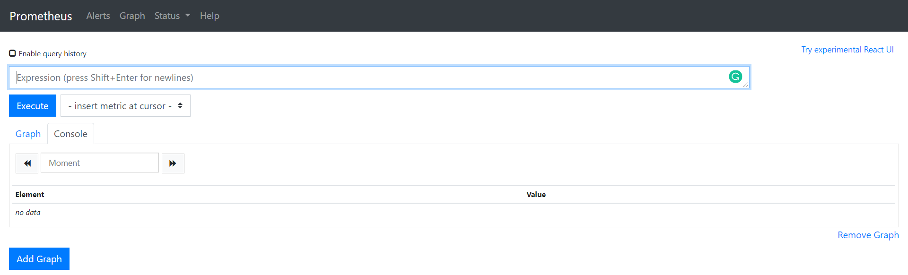

# Monitoring-Kubernetes-using-Grafana-and-Prometheus-Exercise

This is an attempt of monitoring a server, managed by Kubernetes, using Grafana and Prometheus.

## Introduction
* Kubernetes is a portable, extensible, open-source platform for managing containerized workloads and services, that facilitates both declarative configuration and automation. It has a large, rapidly growing ecosystem. Kubernetes services, support, and tools are widely available. [Kubernetes](https://kubernetes.io/docs/concepts/overview/what-is-kubernetes/)
* Prometheus is a software used for event monitoring and alerting. It records real-time metric in a time-series database. [Prometheus](https://en.wikipedia.org/wiki/Prometheus_(software))
* Grafana is a multi-platform open source analytics and interactive visualization web application. It provides charts, graphs, and alerts for the web when connected to supported data sources. [Grafana](https://en.wikipedia.org/wiki/Grafana)

## Prerequisites
* In order to see how Grafana and Prometheus work, first run a Kubernetes cluster. In this attempt, I will be using Minikube which runs a single-node Kubernetes cluster. The installation guide can be seen [here](https://kubernetes.io/docs/tasks/tools/install-minikube/). In my case, I use [Chocolatey](https://chocolatey.org/) to install minikube.
  ```
  $ choco install minikube
  ```
* The Kubernetes command-line tool, kubectl, allows to run commands against Kubernetes clusters. kubectl is used to deploy applications, inspect and manage cluster resources, and view logs. Install it using Chocolatey.
  ```
  $ choco install kubernetes-cli
  ```
* Helm is a package manager for Kubernetes, which is used to install Prometheus and Grafana. Use Chocolatey to install helm.
  ```
  $ choco install kubernetes-helm
  ```
 
 Once all the requirements are set, it is time to move into the next step.
 
## Install Prometheus

* It is recommended to install Prometheus in a separate namespace to be easier to manage. Create a namespace called monitor:

  ```
  $ kubectl create ns monitor
  ```
* Then, install Prometheus using helm.
  ```
  $ helm install prometheus-operator stable/prometheus-operator --namespace monitor
  ```
* Verify the Prometheus installation.
  ```
  $ kubectl get pods -n monitor
  ```
  
* Now that the pods are running, we have the option to use the Prometheus dashboard right from our local machine. This is done by post forwarding the prometheus pod to port 9090:
  ```
  $ kubectl port-forward -n monitor prometheus-prometheus-operator-prometheus-0 9090
  ```
  
  
  Visit http://127.0.0.1:9090 to access the Prometheus dashboard.
  

Now Prometheus is running. We can visualize the metrics recorded in Prometheus using Grafana.

## Install Grafana

* Installing Grafana is similar to installing Prometheus.
  ```
  $ helm install grafana stable/grafana --namespace monitor
  ```
  
  
 * Next, we need to locate the Grafana pod and then port forward to port 3000 access it.
  ```
  $ kubectl get pod -n monitor | grep grafana
  ```
  
  
 * Access the Grafana dashboard on http://127.0.0.1:3000 . We should see Grafana homepage asking for login. The username and password can be obtained using helm with the following command.
  
  
  The username and password can be found in the value of admin-user and admin-password. However, those values need to be decoded using the following command:
  
  
  The username and the password are admin and sLWHEBrnMYxdp61DbUpKXAuqb9Ij98PlAgsk3jHC. Copy this login credentials to the Grafana login page and we should be able to login.
  
## Build the Dashboard
* Once we are able to login, we are redirected to the homepage of Grafana. 
  
* In order Grafana to work, we need to add data source to visualize. In this case, we want to connect the metrics pulled in Prometheus as the data source to Grafana by clicking on the cogwheel button and click the Data Source option. Add data source and select Prometheus. We will see the page below.
  
* In the URL box, we need to specify the node port in which the prometheus pod is running. This is done by navigating to the Prometheus homepage and click on Status>Command-Line Flags. We will see the configuration of the running pod. Find the designated url of the running pod under name "web.external-url". Copy this url to the URL box in the Grafana Data Source page.
  
  
* After the configuration in the data source is set, click Save & Test. Then, if the data source is connected, we will see Data Source is working comment.
  
* Now, it is time to build the dashboard. On the left pane of the Grafana homepage, click the "+"/Create button to create a dashboard or import if using existing templates provided by the [grafana dashboards](https://grafana.com/grafana/dashboards). For the first time of creating a dashboard, we will see a blank space and we just need to add panel to create a visualization of each metric. 
  
  
  
## Create Alert
* After successfully creating a dashboard, we can add a feature, like alerting, in each graph. On each graph, click on the title, then edit. We will see a window for setting the configuration of each graph (e.g. data source, graph properties, metrics to show, etc). Below the graph, there is an alert tab. Select alert tab, then creat a new alert.
  
 
* Then, we just need the specify the condition, under which an alert should be arose. For example, while visualizing CPU usage, we want to set an alert whenever the CPU usage is above 90%. We can then set it inside the condition value. "When avg() of the query is above 90" send an alert.
  


